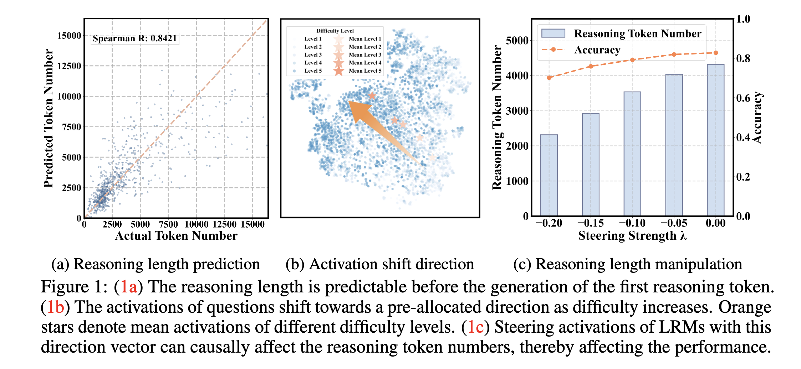

<div align=center>

<h1>On Reasoning Strength Planning
in Large Reasoning Models</h1>


<div>
      <a href="https://lehengthu.github.io//" target="_blank">Leheng Sheng</a><sup>1</sup>,
      <a href="https://anzhang314.github.io/" target="_blank">An Zhang</a><sup>2&#8224</sup>,
      <a href="https://github.com/zjwu0522" target="_blank">Zijian Wu</a><sup>1</sup>,
      <a href="https://circle-hit.github.io/" target="_blank">Weixiang Zhao</a><sup>3</sup>,
      <a href="https://changshuoshen.github.io/" target="_blank">Changshuo Shen</a><sup>2</sup>,
      <a href="https://github.com/zy20031230/" target="_blank">Yi Zhang</a><sup>2</sup>,
      <a href="https://xiangwang1223.github.io./" target="_blank">Xiang Wang</a><sup>2</sup>,
      <a href="https://www.chuatatseng.com/" target="_blank">Tat-Seng Chua</a><sup>1</sup>,

<div>
  <sup>1</sup>National University of Singapore, <sup>2</sup>University of Science and Technology of China, <sup>3</sup>Harbin Institute of Technology
       </div>   
<div>
<sup>+</sup> Corresponding author. 
   </div>

</div>

[](https://opensource.org/licenses/Apache-2.0)
[](https://www.python.org/downloads/release/python-3110/)

</div>

## LRMs plan reasoning strengths with pre-allocated direction vectors



In our paper, we reveal that:

- LRMs plan reasoning strengths in advance, even before the generation of the first reasoning token.
- As the difficulty of questions increases, the reasoning strength of LRMs also increases. Meanwhile, the activations of different difficulty levels shift towards the same direction, with the magnitude of this direction controlling the reasoning strength.
- Steering with the pre-allocated direction vectors can change the reasoning strength of LRMs, which further impacts the final performance.


## Usage

Generate the main results (i.e., linear regression, direction vector extraction and analysis) in this paper:

```bash
bash scripts/analyze.sh
```

Evaluate the effect of steering:

```bash
python AnalyzeSteerFull.py
```

Replicate the results of the overthink detection before generation:

```bash
python eval_overthink.py
```

Replicate the results of the efficient inference:

```bash
python efficient_reasoning.py
```

## Activation Steering with vLLM

We implement the activation steering with vLLM, which can be found in `steer_qwen2_vllm.py` file.
To enable the usage of vLLM, you need to set the environment variable `steering_vector_path` to the path of the steering vector.

```bash
export steering_vector_path=/path/to/steering_vector.npy
```


## ☎️ Contact

Please contact the first author for any questions.

- Leheng Sheng, leheng.sheng@u.nus.edu

